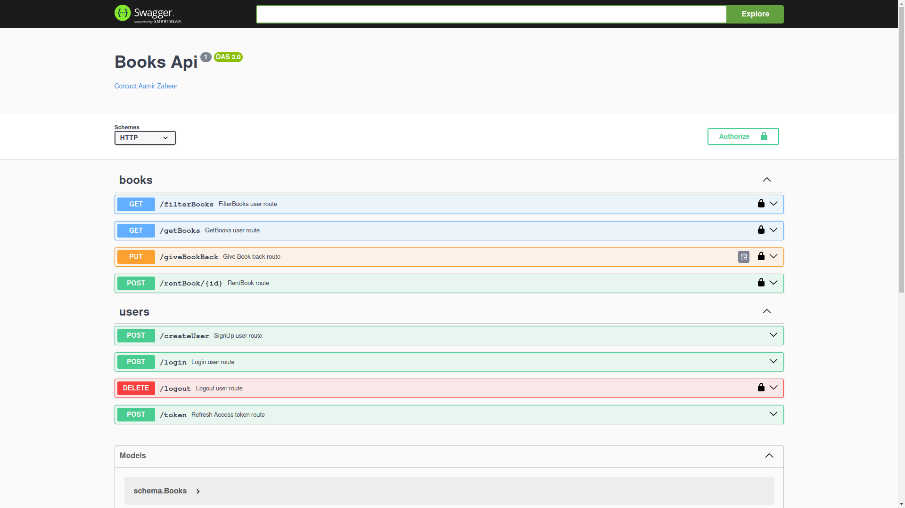

# onlineLibrarySystem
Online library system to search and rent books.

A full microservice architecture API containing Books service and Auth service.

<a href="./images/screenshot.png">
  
</a>

## Features✨:
* User's can create a account by entering their email id and password.
* Users can login to their account by entering their credentials this will genetate a Access token (which will be valid for 5 mins) and a Refresh token. 
* Once Authorized users can search for books and rent books. 
* A admin protected route which can clear rent details of users if book submitted on time.
* There is also a nginx container which proxies the incomming request to the services.

This is a online library management simulation where users can see how a high performance online library system works. 

## Tech stack used⚙️:
* **Backend:** Golang
* **Database:** Postgres
* **Authentication:** JWT
* **Architecture:** Microservice
* **Containerization:** Docker

<a href="./images/screenshot1.png">
  
</a>

## NOTE⭐:
* Once the Access token is generated copy the access token inside the double quotes and click on AUTHORIZE button on the top right corner and paste the token in this format:
Bearer <access_token>
* Once access token becomes invaild after 5 mins take the refresh token that was genrated at the time of login and go to the token route to generate a new access token from the refresh token.

## Security🔒:
* The password's entered by users are stored in the DB in a secure format.
* When the user enters password the API genrates a random salt which is then conbined with the users password and hashed. This hash and salt is then stored in the DB. 
* All the Book search route and Book rent route are protected routes which can only be accessed by authorized users.

## Automated Email Notifications 🤖:
* A scheduled task runs every day at 11:00 AM, initiated by the server's cron job.
* This task is designed to automatically send email notifications to users whose book rental period is nearing its end.

## Installation:
* Make sure you have Golang and postgres installed on your system. 
<pre>
```bash
git clone https://github.com/zaheerAamir/onlineLibrarySystem.git
```
</pre>
* Just clone the Repo make the required changes and submit a pull request.